# Dynamic Ticketing System - Sequence Diagrams

## 1. TẠO SỰ KIỆN (Create Event)

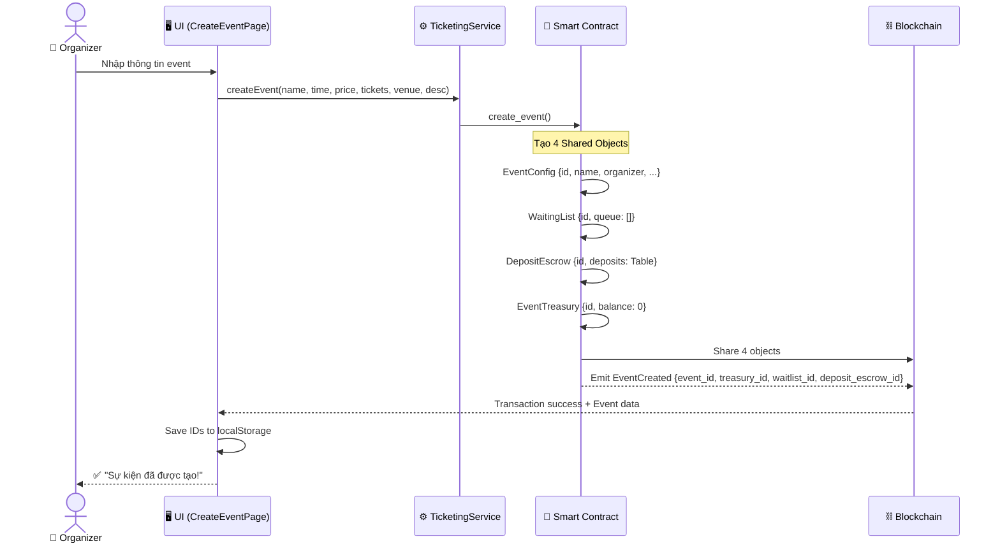

**Objects Created:**
- `EventConfig` - Shared (mutable)
- `WaitingList` - Shared (mutable) 
- `DepositEscrow` - Shared (mutable)
- `EventTreasury` - Shared (mutable)

---

## 2. MUA VÉ (Mint Ticket)

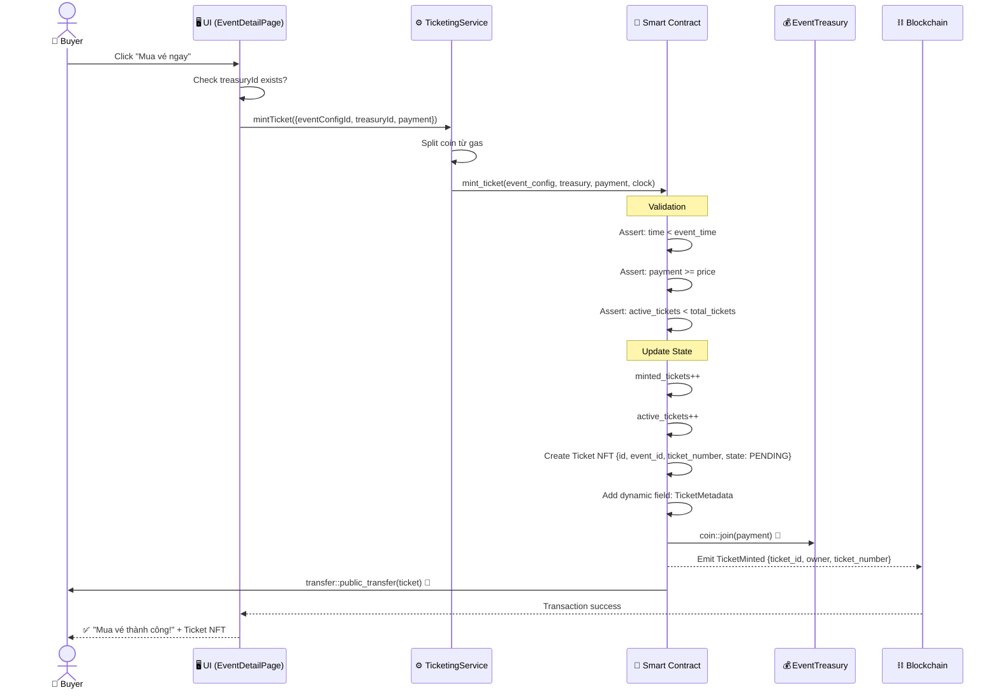

**Flow tiền:**
- User gas → Treasury balance
- Ticket NFT → User wallet

---

## 3. HOÀN TIỀN VÉ (Refund Ticket)

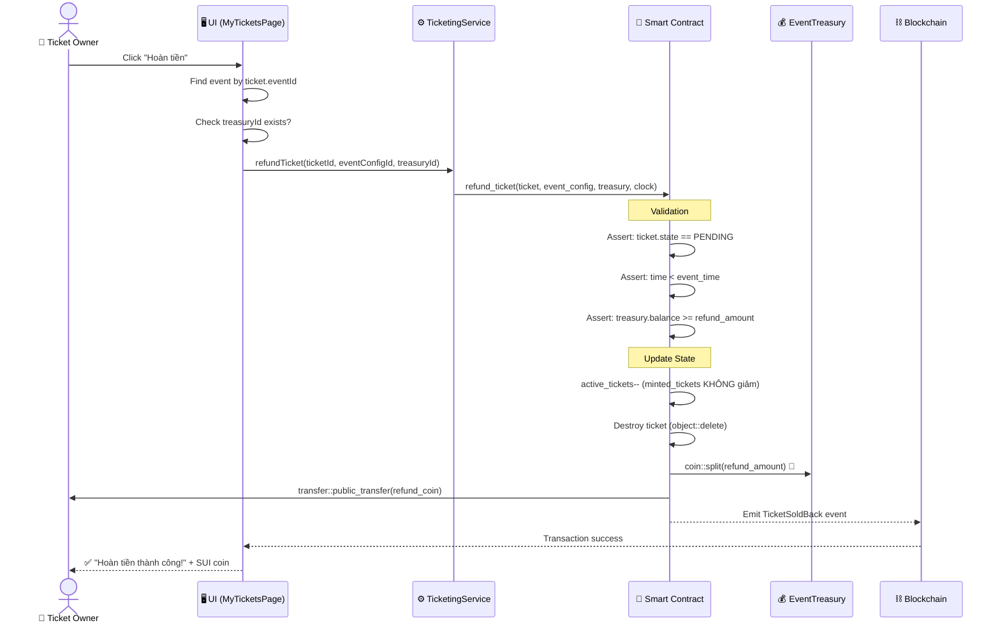

**Flow:**
- Ticket → Destroyed ❌
- Treasury balance → User wallet 💰
- `minted_tickets`: không đổi (statistic)
- `active_tickets`: giảm 1 (slot available)

---

## 4. CHECK-IN VÉ (Check In Ticket)

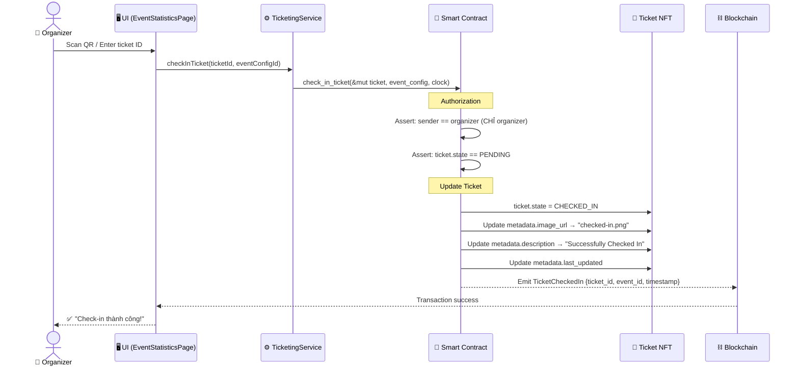

**Quyền hạn:**
- ⚠️ CHỈ organizer mới check-in được
- Ticket owner pass `&mut Ticket` = auto-verified ownership

---

## 5. THAM GIA HÀNG CHỜ (Join Waitlist)

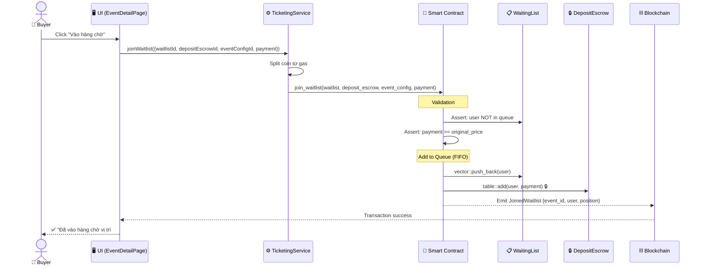

**Deposit Escrow:**
- Payment coin được lock trong DepositEscrow
- Sẽ dùng để mua vé khi có người sell back
- FIFO queue (first in, first out)

---

## 6. BÁN LẠI VÉ (Sell Back Ticket)

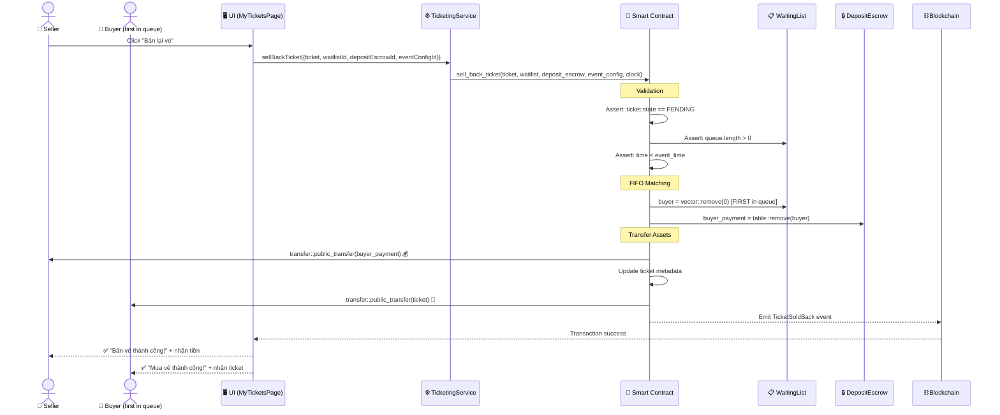

**Anti-Scalping:**
- ✅ FIFO queue (không chỉ định buyer)
- ✅ Original price (deposit == original_price)
- ✅ Automatic matching (không thương lượng)

---

## 7. ORGANIZER RÚT TIỀN (Organizer Withdraw)

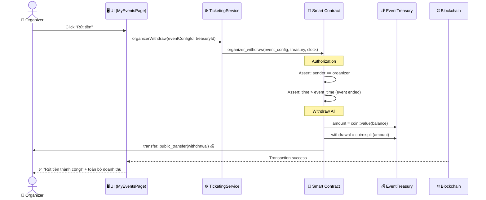

**Điều kiện:**
- ⚠️ CHỈ organizer
- ⚠️ SAU khi event kết thúc (không còn refund)

---

## 8. CHUYỂN THÀNH KỶ NIỆM (Transform to POAP)

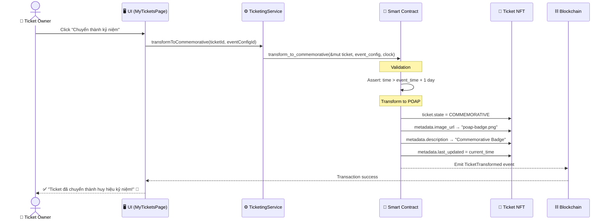

---

## 9. HỦY SỰ KIỆN (Cancel Event)

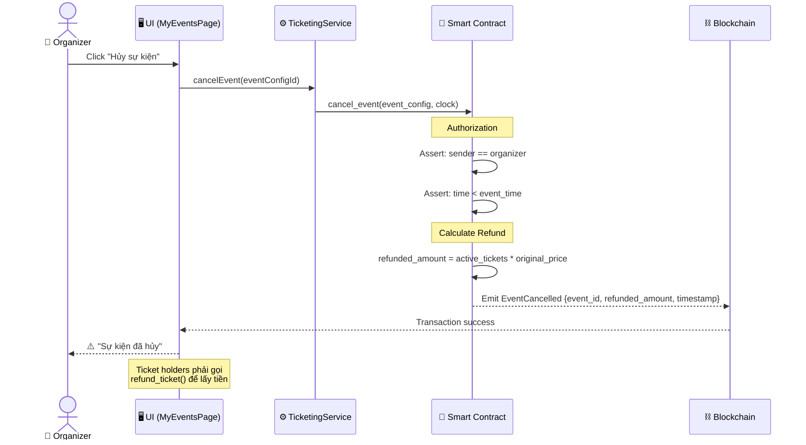

---

## KEY SECURITY PATTERNS

### 🔐 Sui Ownership System
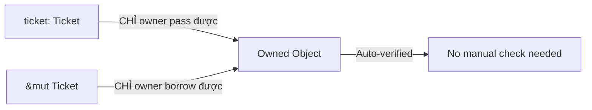

### 💰 Treasury Escrow Flow
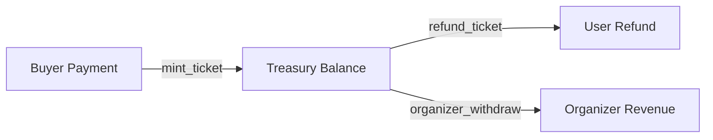

### 📊 Ticket Counters
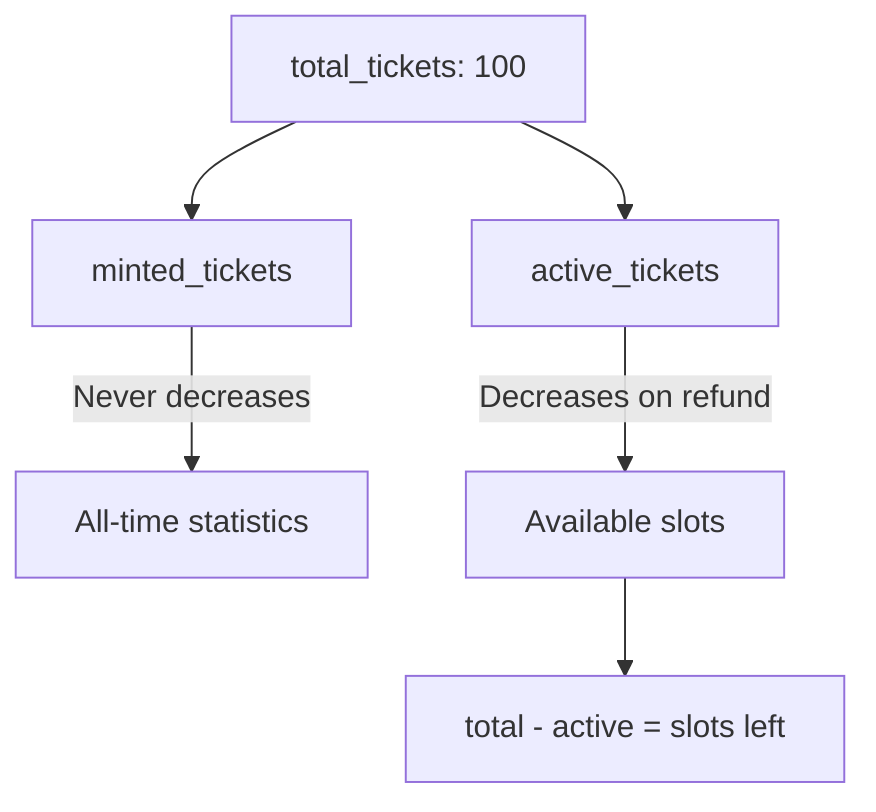

---

## ERROR CODES

| Code | Name | Description |
|------|------|-------------|
| 0 | `ENotEventOrganizer` | CHỈ organizer |
| 1 | `EEventAlreadyStarted` | Event đã bắt đầu |
| 2 | `ETicketAlreadyUsed` | Vé đã check-in |
| 3 | `EInvalidPrice` | Giá sai |
| 6 | `EWaitlistEmpty` | Không có người chờ |
| 7 | `EAlreadyInWaitlist` | Đã trong hàng chờ |
| 8 | `ECannotSellCheckedInTicket` | Không bán vé đã check-in |
| 9 | `EInsufficientTreasury` | Treasury không đủ tiền |
| 10 | `ESoldOut` | Hết vé (active_tickets >= total_tickets) |

---

## COMPLETE DATA FLOW

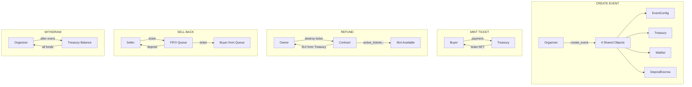
